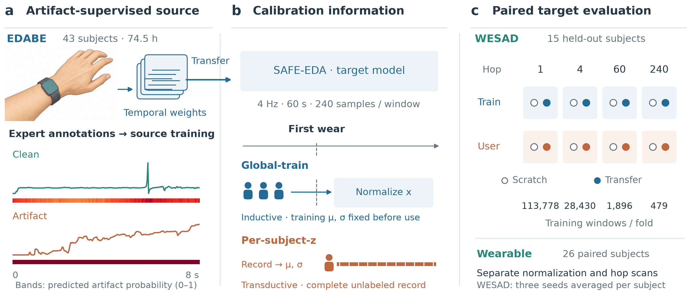
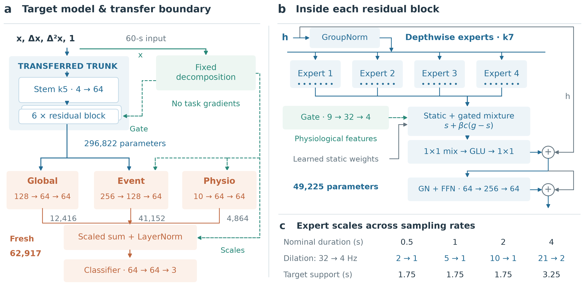
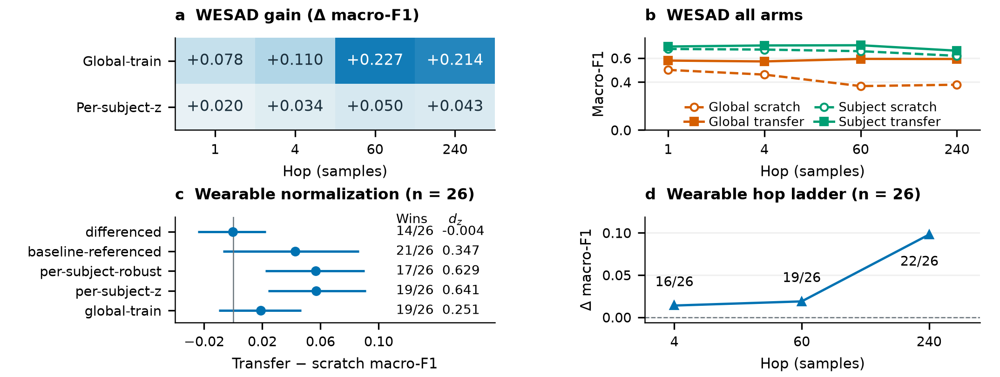
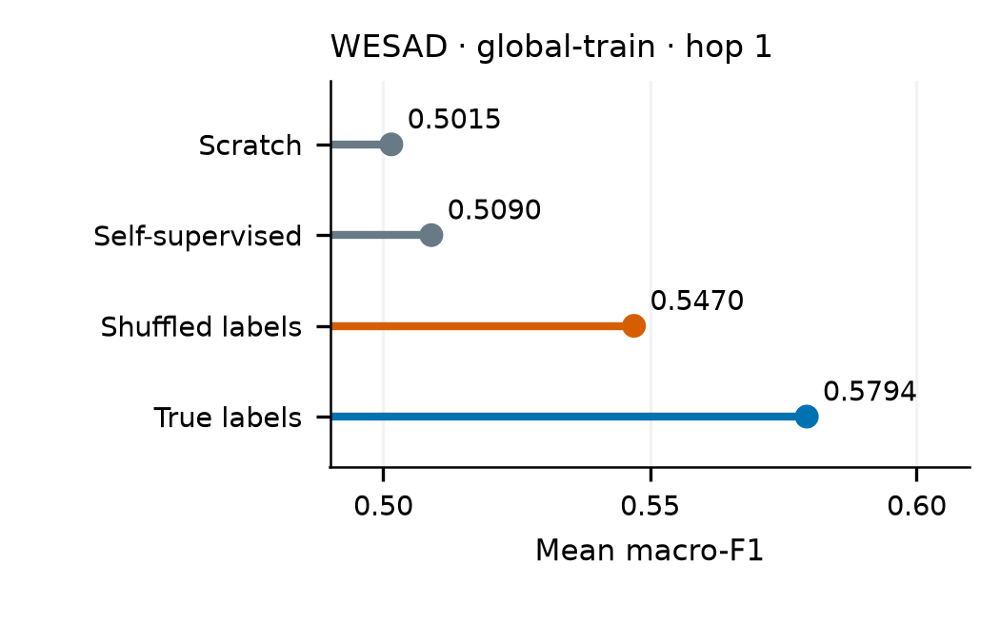

# SAFE-EDA

**Artifact-supervised wrist electrodermal activity (EDA) affect recognition**

[](https://www.python.org/)
[](LICENSE)
[](LICENSE-DATA)
[](https://doi.org/10.5281/zenodo.22920792)

This repository contains the code, derived inputs, literature coding, and
figure assets used in:

> **Artifact Annotations Substitute for Per-User Calibration: SAFE-EDA and a
> Calibration-Controlled Evaluation of Wrist-EDA Affect Recognition**

Haochen Chai, Xinbi Luo, Zining Liu, and Fangfang Jiang. Manuscript, 2026.

The release reproduces the paper's numerical tables and the figures that can
be generated from the supplied result-level inputs. It does not redistribute
the EDABE, WESAD, or PhysioNet recordings.

## At a glance

SAFE-EDA uses artifact annotations from an electrodermal activity source task
to initialize a compact affect-recognition model. The evaluation separates
the contribution of the supervision signal from per-user calibration and
tests both factors across normalization and window-hop conditions.

### Selected figures

<p align="center">
  
</p>
<p align="center"><em>System overview: artifact supervision, calibration information, and paired target evaluation.</em></p>

<p align="center">
  
</p>
<p align="center"><em>Architecture detail: transferred temporal features and target-side affect classification.</em></p>

<p align="center">
  
</p>
<p align="center"><em>Experiment atlas: normalization, window-hop, and cross-configuration results.</em></p>

<p align="center">
  
</p>
<p align="center"><em>Supervision ladder: the controlled comparison of scratch, self-supervised, shuffled-label, and artifact-supervised training.</em></p>

## Key results

- Artifact supervision improves the controlled target result from **.5015**
  (scratch) to **.5794** with the same target architecture and data flow.
- Transfer is the better arm in **12 of 13** tested cross-configuration
  comparisons across WESAD and Wearable data.
- The wrist-EDA-only result is **.7815** accuracy (95% CI: **.7040-.8485**)
  in the directly comparable task summary.

These values are reported with the protocol conditions defined in the paper;
the repository does not claim that all published studies use identical
splits, window lengths, hop sizes, or calibration procedures.

## Quick start

The table-reconstruction environment uses Python **3.14.5**. Dependencies are
pinned in `requirements.txt` and were tested on CPU-enabled macOS.

```bash
python3.14 -m venv .venv
source .venv/bin/activate
python -m pip install -r requirements.txt
python -m pip install --no-deps -e .
python -m safe_eda check
python -m safe_eda reproduce
python -m unittest discover -s tests -v
```

`check` verifies the model parameter counts and tensor shapes. `reproduce`
reads the supplied result-level inputs, reconstructs the tables, and writes
the numerical figures to `outputs/`. The tests compare regenerated tables
with the reference files byte for byte.

## What is reproduced

### Directly from this repository

- 18 experimental tables, Supplementary Tables S1-S2, and the complete set of
  20 supplied table files
- Figures 2 and 4-6, which use the supplied result-level inputs
- The literature coding and its supporting source quotations
- Model construction, parameter-count checks, deterministic analysis, and
  plotting code

### Requires provider data

Model training and waveform-based Figures 1 and 3 require separately obtained
EDABE, WESAD, or PhysioNet recordings. The training commands accept prepared,
normalized windows; they do not download recordings or construct participant
folds.

### Not included

Trained checkpoints, complete class-probability arrays, and full per-window
prediction arrays are not part of this release. The compact participant-level
inputs needed for the published statistics are included.

## Repository layout

```text
configs/model.json       Model and training settings
data/metrics.zip         Result-level inputs for table reconstruction
data/literature/         Study coding and supporting source quotations
data/results/            Reference manuscript tables (20 CSV files)
docs/figures/            Selected manuscript figures shown above
src/safe_eda/            Model, training, analysis, and plotting modules
tests/                   Model and reproduction tests
```

The main modules are:

| Module | Purpose |
| --- | --- |
| `model.py`, `rf.py` | Target classifier and multiscale temporal blocks |
| `decomposition.py`, `ops.py`, `pooling.py` | Fixed signal decomposition and pooling |
| `transfer.py` | Source artifact head and temporal-weight transfer |
| `training.py`, `cli.py` | Training, checkpoint I/O, prediction, and commands |
| `analysis.py` | Deterministic table reconstruction |
| `plotting.py`, `schematics.py` | Numerical and architecture figures |

## Training and prediction

Training starts from prepared NPZ windows. Keep held-out subjects separate
when preparing folds. For global-train normalization, fit statistics on
training subjects only; per-subject-z uses the complete unlabeled subject
recording. These are distinct evaluation conditions.

| Input | Arrays | Sampling rate |
| --- | --- | --- |
| Source training | `x`: float32 `[N, 1, 256]`; `target`: binary `[N, 256]` | 32 Hz after preprocessing |
| Target training | `x`: float32 `[N, 1, 240]`; `y`: integer `[N]` in `{0, 1, 2}` | 4 Hz |
| Prediction | `x` with the shape required by the checkpoint | As above |

```bash
python -m safe_eda train-source \
  --data datasets/source_train.npz --output runs/source.pt --seed 1005
python -m safe_eda train-target \
  --data datasets/target_train.npz --source runs/source.pt \
  --output runs/target.pt --seed 1005
python -m safe_eda predict \
  --data datasets/target_test.npz --checkpoint runs/target.pt \
  --output runs/predictions.npz
```

Omit `--source` for the scratch arm. Use the same seed for source and
transfer checkpoints. `--config` selects a local JSON configuration and
`--device` defaults to `cpu`. Prediction writes `artifact_probability` for
source checkpoints or `predicted_class` for target checkpoints.

## Source data and licensing

The original recordings and annotations must be obtained from their
providers. This repository contains no raw files from these datasets.

| Dataset | Release | Identifier and access | Terms |
| --- | --- | --- | --- |
| Electrodermal Activity artifact correction BEnchmark (EDABE) | v2 | [10.17632/w8fxrg4pv5.2](https://doi.org/10.17632/w8fxrg4pv5.2), [Mendeley Data](https://data.mendeley.com/datasets/w8fxrg4pv5/2) | CC BY 4.0 |
| Wearable Stress and Affect Detection (WESAD) | ICMI 2018 | [Paper DOI](https://doi.org/10.1145/3242969.3242985), [dataset access](https://ubi29.informatik.uni-siegen.de/usi/data_wesad.html) | Scientific, non-commercial use with attribution under provider terms |
| Wearable Device Dataset from Induced Stress and Structured Exercise Sessions | PhysioNet v1.0.0 | [10.13026/zzf8-xv61](https://doi.org/10.13026/zzf8-xv61), [dataset access](https://physionet.org/content/wearable-device-dataset/1.0.0/) | Open Data Commons Attribution License v1.0 |

## Paper-to-file map

The following files are in `data/results/` unless noted otherwise.

| File | Manuscript location |
| --- | --- |
| `T01_protocol_ladder.csv` | Table I: evaluation splits |
| `T04_edabe_source_task.csv` | Results: artifact detection |
| `T05_normalization_ladder.csv` | Table V; experiment atlas |
| `T06_hop_ladder.csv` | Table VI; experiment atlas |
| `T07_cross_configuration_stability.csv` | Results: cross-configuration stability |
| `T08_label_permutation.csv` | Table IV; supervision ladder |
| `T10_class_level_net_change.csv` | Results: class-level changes |
| `T11_calibration_subject_level.csv` | Results: probability calibration |
| `T12_headline_result.csv` | Abstract; WESAD headline metrics |
| `T13_epoch_curves.csv` | Data supplement: fixed-budget epoch summaries |
| `T14_method_ladder.csv` | Table IV; supervision ladder and controls |
| `T15_equivalence.csv` | Data supplement: paired differences |
| `T16_transition_window_axis.csv` | Data supplement: transition-window diagnostics |
| `T17_normalization_hop_cross_grid.csv` | Table II; experiment atlas |
| `T18_interaction_test.csv` | Table III |
| `T19_stability_by_normalization.csv` | Results: across-hop ranges and SD ratios |
| `T20_normalization_value_by_hop.csv` | Results: normalization effects by hop |
| `T21_subject_level_grid.csv` | Subject-level effects figure |
| `S01_literature_study_codes.csv` | Supplementary Table S1 |
| `S02_literature_reporting_counts.csv` | Supplementary Table S2 |

`data/literature/study_coding.csv` contains the coded study fields used to
construct S1 and S2. `data/literature/source_quotes.csv` links each reported
field to a source passage and its section or page location, so readers can
check the literature coding row by row.

## Citation

Citation metadata is available in [CITATION.cff](CITATION.cff). The software
release is archived at [Zenodo DOI 10.5281/zenodo.22920792](https://doi.org/10.5281/zenodo.22920792)
and the source repository is [GitHub](https://github.com/rtb-1005/SAFE-EDA).
The article DOI will be added after publication.

## Licenses

Code and documentation are released under the [MIT License](LICENSE).
Derived result tables and literature coding are released under
[CC BY 4.0](LICENSE-DATA). Source datasets retain their provider terms.
